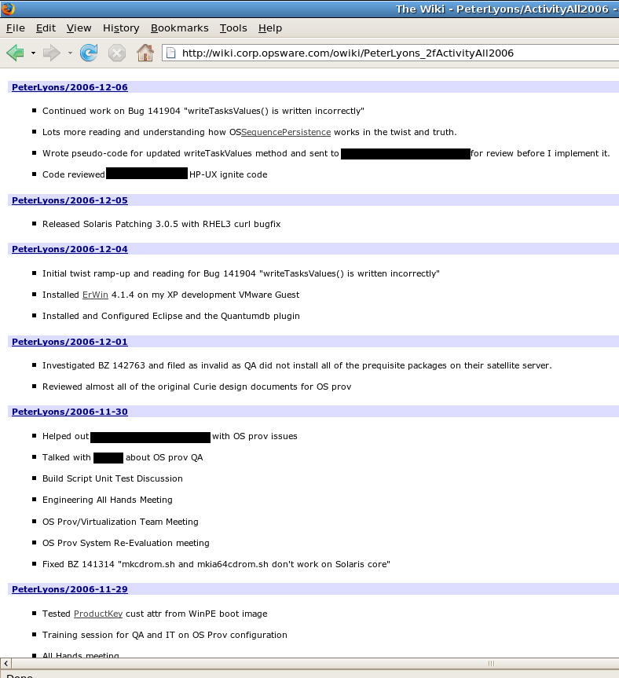

+++
title = "Range Daily Checkins"
date = 2024-01-16T00:31:48Z
+++

I've started a new position as Staff Engineer at Float Health. We're using a nice SaaS tool called [Range](https://www.range.co/) for daily checkins as well as meeting agendas and notes. The workflow encourages everyone to write a small handful of bullets about the main things they worked on each day. We are lucky enough to have Range founder Dan Pupius working with us at Float Health, and I had to smile and send him this ancient screenshot. This is essentially my daily check-in/log built from unix tools and a corporate wiki server..checks notes..18 years ago.

I hope Dan got a chuckle out of it. Needless to say, I'm a big fan of the tool and this is still a key part of my workflow for staying in good communication with my team and for activity records that can be used to build brag docs when promotion season rolls around.

