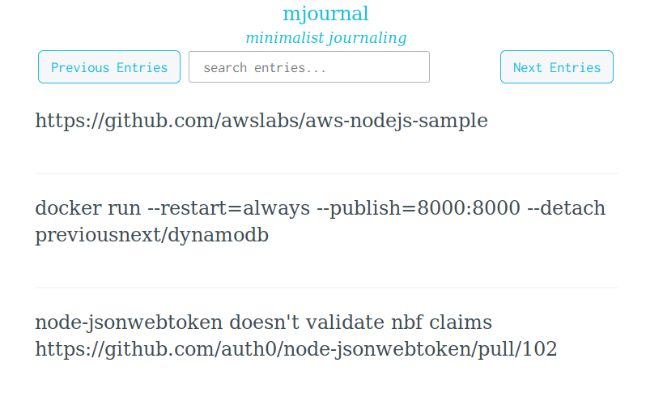
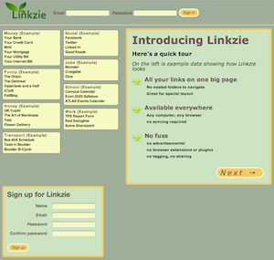
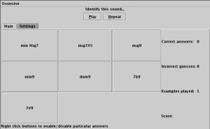
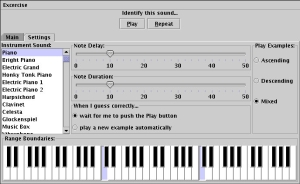

+++
title = "Software Projects"
+++
# Projects

Some notes about some of my more interesting projects are below. This is not an all-inclusive list, so feel free to [look through my github account](https://github.com/focusaurus) for other things I have built or contributed to.

<section class="project">

## Trello Hello

[trello-hello](https://github.com/focusaurus/trello-hello) (2023) is a small CLI utility written in Go to display my trello to do list in a compact format in the terminal.

</section>
<section class="project">

## mjournal

[mjournal](https://github.com/focusaurus/mjournal) (2013-2019) is a minimalist journaling web application. It has a simple data model with entries stored chronologically and full-text search and tags for organization. There are 2 visual themes. The stack is postgresql, express, and angularjs and it is deployed via docker.

</section>
<section class="project">

## White Glove

[white-glove](https://github.com/focusaurus/white-glove) (2016) is a data integrity checking utility for MongoDB, CouchDB, and any set of JSON objects.

</section>
<section class="project">

## Linkzie

**Linkzie** (2011-2019) is a web-based bookmark management application. It differs from many others in that it gives you "one big wall of links" layed out in a grid that is optimized for spacially-oriented thinking/memory. It has a nice drag and drop UI and in-place editing. The stack is jQuery/JavaScript in the browser, Ruby on Rails and PostgreSQL on the server.

</section>
<section class="project">

## Commander

[Commander](https://github.com/focusaurus/commander) (2011-2018) is my python-based command interpreter for OS automation/utility. The README on github is extensive, so click through for details.

</section>
<section class="project">

## Wallah

Help node or python projects bootstrap themselves. [github.com/focusaurus/wallah](https://github.com/focusaurus/wallah). (2014-2015)

</section>
<section class="project">

## Express Code Structure

[express_code_structure](https://github.com/focusaurus/express_code_structure) (2013) is a template project for a well-organized express.js application. Created in support of one of my most popular stackoverflow answers.

</section>
<section class="project">

## Plus Party

[Plus Party](/plus-party) (2014-2020) is a little app I wrote to help with quick and informal numeric subtotals when tax season comes around and because I couldn't find an existing calculator app that worked this way. It has been implemented thus far in AngularJS then ReactJS then Elm.

</section>
<section class="project">

## Flick Date Fixer

Flickr Date Fixer (2013) is a web application I built to fix incorrect dates on photos taken with my smartphone and uploaded to [flickr](http://flickr.com). The app is built with

* node.js
* express.js
* passport.js for OAuth integration with Flickr
* coffee-script
* flickr's API (and the node-flickr wrapper module)
* backbone.js
* jQuery

More details on my [blog post about it](/problog/2013/04/flickr-date-fixer). I'm pretty sure I'm the only person who ever used it, and I only deployed it to nodejitsu so more likley that not, the app is probably down at the moment. It's open source and available on github at [focusaurus/flickr-date-fixer](https://github.com/focusaurus/flickr-date-fixer).

</section>
<section class="project">

## Othenticate

Othenticate (2011-2012) was an prototype I built for a SaaS product to provide account management (login, change password, etc) for web applications. It's been idle for a while after I concluded it was a bit too ambitious for a one-person lifestyle business type app. It's built on node, express, and mongodb.

</section>
<section class="project">

## SmartEars

Back in the summer of 2001 I wrote an ear training (musical pitch recognition) program in Java Swing.

This program will help you quickly learn to recognize and identify common musical
structures including intervals, scales/modes, and chords.

You can download <a href="https://github.com/focusaurus/peterlyons.com_old_v4.2/raw/master/public/dist/smartears.jar">smartears.jar</a> and launch the
application by typing:

`java -jar smartears.jar`

Using SmartEars should be (I hope!) largely self-explanatory and easy.

Two quick tips:

* To turn off certain answers you are not intrested in
    (eg. unisons and octaves) right-click on their button (Command-click on OS X)
* To hear sounds played simultaneously (as a chord) instead of arpeggiated,
    click into the Settings Tab and set the Note Delay to 0

Note that as of July 2024 this program does still kind of work on modern java virtual machines but it's a little glitchy. Try changing the settings for note delay and note duration and it eventually still mostly works some 23 years later!
</section>
<section class="project">

## BigClock

BigClock (2001) is a simple desktop clock utility that fills up the entire window with a clock, so you can get a clock of any size. It allows you to choose your own colors and time format. You can [download bigclock.jar here](https://github.com/focusaurus/peterlyons.com_old_v4.2/raw/master/public/dist/bigclock.jar) and run it with the command `java -jar bigclock.jar` using JRE 1.3 or newer.

Note that as of July 2024 this program still runs perfectly some 23 years later!
</section>
